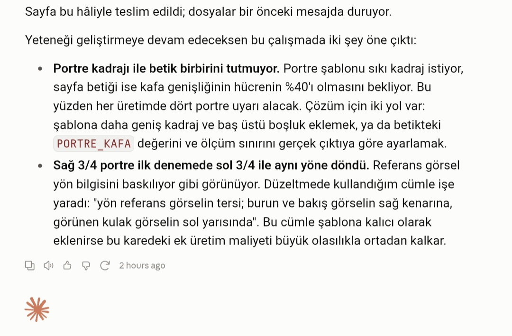
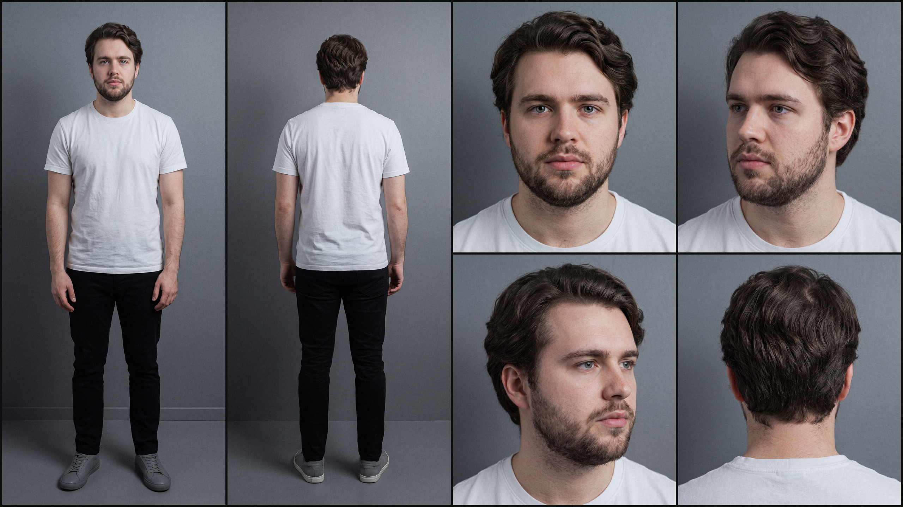

# Claude Skill - Karakter Sayfası Oluşturucu
Claude'a ''Karakter Referans Sayfası (Character Sheets)'' oluşturma yeteneği kazandıran Claude SKILL. Bu yetenek sayesinde Claude; görüşmeyi yönetir,
kareleri tek tek üretir, kalite denetimi yapar, panelleri birleştirir ve son bir fotografik geçiş
uygular.

**NOT:** Bu yetenek Claude uygulaması içerisinde ''skill-generator'' yeteneği kullanılarak Opus 5 (High) ile birlikte geliştirilmiştir.

**Örnek Workflow**





## Özellikler
- **Gelişmiş Mikro Detaylar:** Claude, gözlerde gradyan geçişli iris ve kulaklarda hafif ayva tüylerin bulunması gibi önceden tanımlanmış mikro detayları hazırladığı prompta enjekte eder.
- **Yüksek Çözünürlük:** Her görsel 2K çözünürlükte ayrı ayrı üretilir. Karakter sayfası da benzer şekilde 2560x1440 çözünürlüğe sahiptir.
- **Kalite Kontrol ve Revizyon Mekanizması:** Claude, otonom şekilde her ürettiği görsele tek tek kalite kontrol uygular. Onay almayan görselleri, promptu revize ederek yeniden üretir. Onay konusunda kararsız kaldığı ve kabiliyetlerini aşan durumlarda görseli kullanıcının onayına sunar.
- **Yüksek Tutarlılık:** İlk üretilen profil her görselin için temel referanstır. Bunu sağlamak için her üretilen görsel, önceki görseller ile birlikte bir sonraki görseli besler.
- **Replicate MCP:** Görsel üretimi MCP aracılığıyla Replicate platformu üzerinden Nano Banana Pro modeli ile gerçekleştirilir.

## İş Akışı
1. **Kullanıcı ile Diyalog:** Karakterin görünümü ve kimliği üzerine soru-cevap formatında diyalog gerçekleştirilir.
2. **Profil Taslağı:** Claude, aldığı cevaplar doğrultusunda hazırladığı profil taslağını kullanıcının onayına sunar.
3. **Referans Görselin Üretimi:** Karakterin ilk görseli üretilerek kimlik referansı hazırlanır ve kullanıcıya sunulur. Onay alırsa asıl üretim başlar.
4. **Diğer Görünümlerin Üretimi:** Onaylanan kimlik üzerinden karakterin 5 farklı stilde görünümü hazırlanır.
5. **Panelleri Birleştirme:** Önceden hazırlanmış ve yetenek içerisinde tanımlanmış şablon üzerinden ''python script'' ile görseller mozaik düzeninde birleştirilir.
6. **Fotoğrafik Geçiş:** Adobe Lightroom uygulaması üzerinden kalibre edilmiş ölçüm değerleri ''python script'' formatında uygulanır. Bu işlemdeki amaç yapay zeka görsel modellerinin kronik problemi olan ''aşırı doygun ve PVC görünümü'' azaltmaktır.


## Proje Yapısı
```
karakter-sayfasi-olusturucu/
├── SKILL.md   # Yetenek sayfası
├── references/
│   ├── gorusme.md   # Kullanıcı ile kurulacak diyaloğun genel çerçevesi    
│   ├── prompt-mimarisi.md   # Promptların nasıl üretilecği konusunda yarı esnek yarı sabit açıklamalar
│   ├── kalite-kontrol.md   #  Üretilen görsellere kalite kontrol uygulama rehberi
│   └── sayfa-duzeni.md   # Mozaik düzeninin nasıl sağlanacağı ve ızgara yapısı    
└── scripts/
    ├── birlestir.py   # Üretilen görselleri panel mantığı ile birleştiren script
    └── foto_ayar.py   # Fotografik geçiş script'i
```

## Yol Haritası
### v1.0
Mevcut sürüm ve kullanıma hazır.

### v2 - Planlandı
Tespit edilen hatalar ve istenen geliştirmeler doğrultusunda aşağıdaki güncellemeler gerçekleştirilecektir;

- **Gelişmiş Kimlik Atama:** Gerçekçiliği ve kaliteyi arttırmak için oluşturulan karakterlere kısa bir biyografi ataması yapılacaktır.
- **İletişim Dili Optimizasyonu:** Opus 5 modeli daima türkçe iletişim kuruyor ancak Sonnet 5 modeli bazen İngilizce diyalog kuruyor. Bu sapma ''daima Türkçe konuşması için'' eklenecek bir satır ile çözülecek.
- **Bildirim Stili Değişikliği:** Bildirimler kullanıcıya ''Summary'' paneli üzerinden değil doğrudan sohbete yazarak aktarılacak.
- **Üretim Sırası Değişikliği:** İş akışı, ilk olarak portreleri üretip daha sonra tam boy görselleri üretecek şekilde güncellenecek.
- **Zip Formatında Sıkıştırma:** Model, kullanıcıya görselleri sohbet içerisinde ayrı ayrı dosyalar olarak değil tek bir .zip dosyası olarak vermeli.
- **İsimlendirme Formatı Güncellemesi:** Dosyaları isimlendirilmesi şu formatta sabitlenecek:
	- Görseller --> [İsim] [Çekim Türü]
	- Referans Sayfası --> [İsim] - Karakter Referans Sayfası
	- Klasör --> [İsim].zip
- **Kadraj Oranı Esneklik Payı:** Model, üretilen görsellerin kadraj oranı birebir tutmadığı için hata mesajı vermekte. Ancak bu oranlar tolere edilebilir düzeyde esnetilebilir. Bunun için ilgili python betiğine %10 esneme payı eklenecek.
- **Karakter Duruşu Değişikliği:** Çapraz profil görsellerde, karakter sadece kafasını sağ ve sol taraflara çeviriyor. Bunun yerine komple vücudu sağ/sol çapraza dönük olmalı.
- **Çözünürlük Artışı:** Üretilen görsellerin ve referans sayfasının çözünürlüğü 2K'dan 4K'ya yükseltilecek.
- **Aksiyon Özeti:** Her üretimden sonra, üretilen karakterin ve yapılan işlemlerin kısa bir dökümü sunulacak.

## Lisans
Bu proje [MIT Lisansı](LICENSE) ile lisanslanmıştır.
