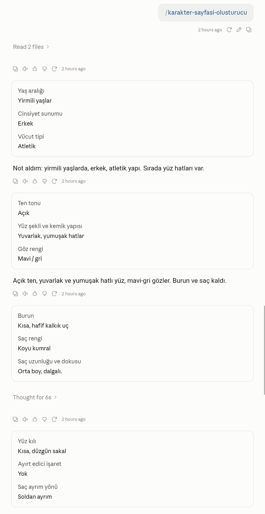
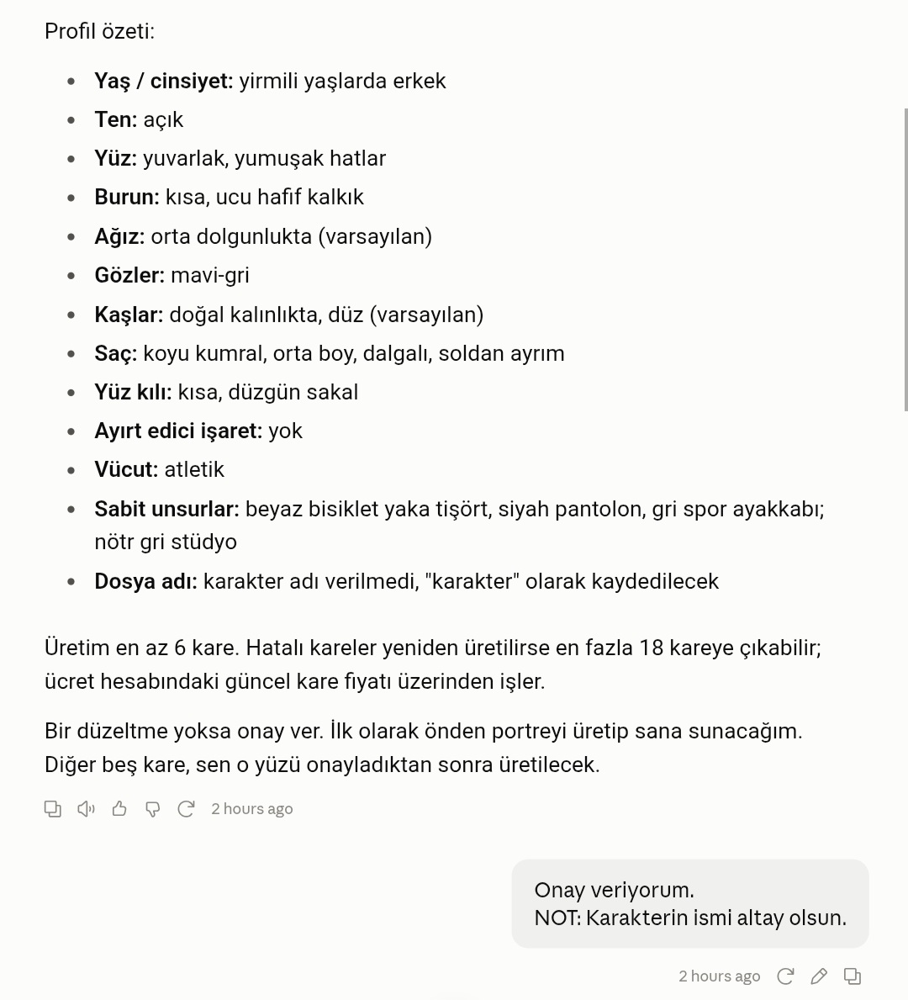
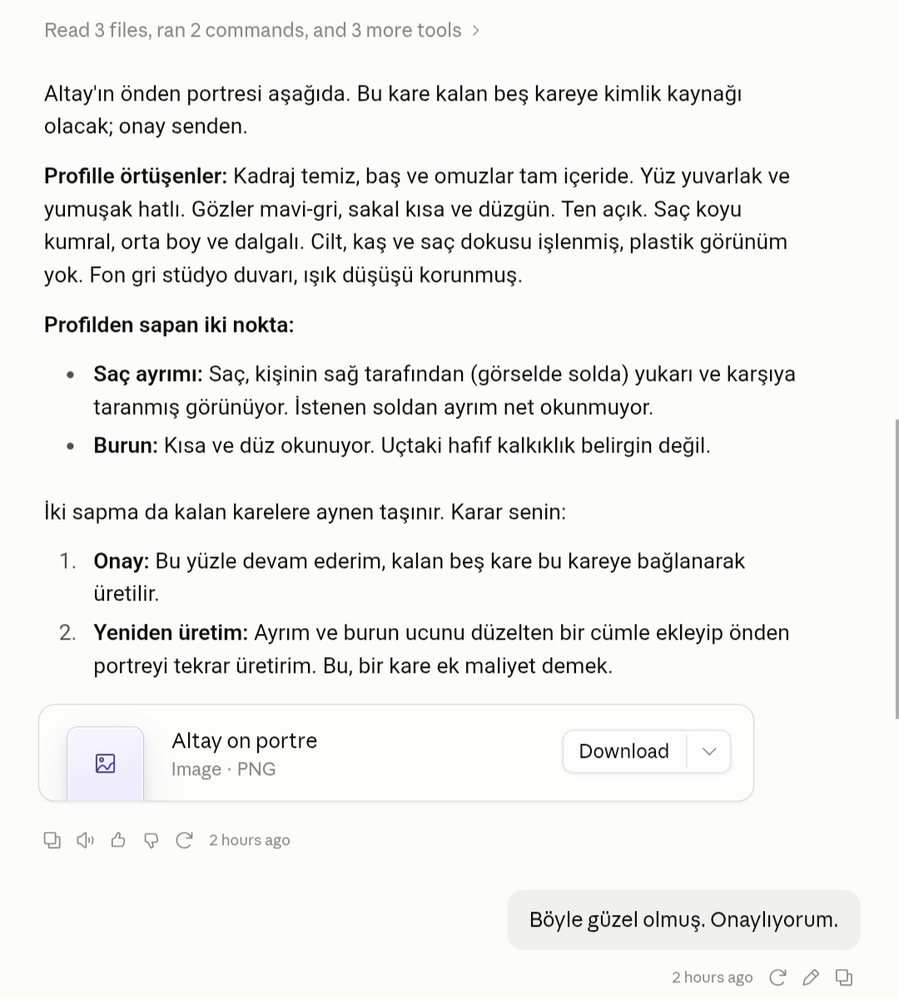
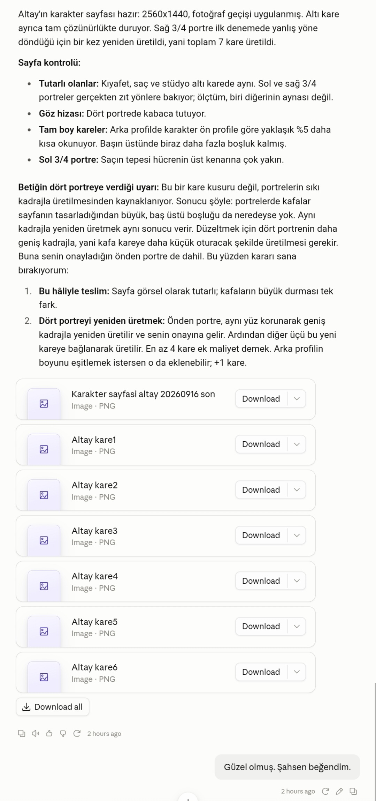

# Claude Skill - Karakter Sayfası Oluşturucu
Claude'a ''Karakter Referans Sayfası (Character Sheets)'' oluşturma yeteneği kazandıran Claude SKILL. Bu yetenek sayesinde Claude; görüşmeyi yönetir,
kareleri tek tek üretir, kalite denetimi yapar, panelleri birleştirir, son bir fotografik geçiş
uygular ve çıktıyı tek bir arşiv olarak teslim eder.

**NOT:** Bu yetenek (v1.0) Claude uygulaması içerisinde ''skill-generator'' yeteneği kullanılarak Opus 5 (High) ile birlikte geliştirilmiştir.

**NOT:** Yetenek Claude Code üzerinden Opus 5 (High) ile birlikte geliştirilmeye devam etmektedir.

**Güncel sürüm: v2.0**

## Özellikler
- **Gelişmiş Mikro Detaylar:** Claude, gözlerde gradyan geçişli iris ve kulaklarda hafif ayva tüylerin bulunması gibi önceden tanımlanmış mikro detayları hazırladığı prompta enjekte eder.
- **4K Çözünürlük:** Her görsel 4K çözünürlükte ayrı ayrı üretilir. Karakter sayfası da benzer şekilde 3840x2160 çözünürlüğe sahiptir.
- **Kalite Kontrol ve Revizyon Mekanizması:** Claude, otonom şekilde her ürettiği görsele tek tek kalite kontrol uygular. Onay almayan görselleri, promptu revize ederek yeniden üretir. Onay konusunda kararsız kaldığı ve kabiliyetlerini aşan durumlarda görseli kullanıcının onayına sunar.
- **Yüksek Tutarlılık:** İlk üretilen portre her görselin temel referansıdır; tam boy kareler ayrıca birbirini besler.
- **Karakter Künyesi:** Üretim bittikten sonra karaktere kısa bir Türkçe künye yazılır ve arşive konur.
- **Tek Dosya Teslimat:** Altı kare, referans sayfası ve künye tek bir `.zip` olarak verilir.
- **Aksiyon Özeti:** Her üretimin sonunda ne üretildiğinin ve süreçte ne olduğunun kısa bir dökümü sunulur.
- **Replicate MCP:** Görsel üretimi MCP aracılığıyla Replicate platformu üzerinden Nano Banana Pro modeli ile gerçekleştirilir.

## İş Akışı
1. **Kullanıcı ile Diyalog:** Karakterin görünümü ve kimliği üzerine soru-cevap formatında, Türkçe diyalog gerçekleştirilir.
2. **Profil Taslağı:** Claude, aldığı cevaplar doğrultusunda hazırladığı profil taslağını kullanıcının onayına sunar.
3. **Referans Görselin Üretimi:** Karakterin ön portresi üretilerek kimlik referansı hazırlanır ve kullanıcıya sunulur. Onay alırsa asıl üretim başlar.
4. **Diğer Görünümlerin Üretimi:** Önce kalan üç portre, ardından iki tam boy kare üretilir. Kimlik yüzde okunduğu için portreler öne alınmıştır; olası bir kimlik kayması zincir bozulmadan görülür.
5. **Panelleri Birleştirme:** Önceden hazırlanmış ve yetenek içerisinde tanımlanmış şablon üzerinden ''python script'' ile görseller mozaik düzeninde birleştirilir.
6. **Fotoğrafik Geçiş:** Adobe Lightroom uygulaması üzerinden kalibre edilmiş ölçüm değerleri ''python script'' formatında uygulanır. Bu işlemdeki amaç yapay zeka görsel modellerinin kronik problemi olan ''aşırı doygun ve PVC görünümü'' azaltmaktır.
7. **Künye ve Paketleme:** Karakterin künyesi yazılır; kareler, sayfa ve künye sabit isimlendirmeyle tek `.zip` hâline getirilir.
8. **Teslim ve Aksiyon Özeti:** Arşiv verilir ve yapılan işlemlerin kısa dökümü sunulur.

## Örnek Workflow
_Aşağıdaki ekran görüntüleri v1 akışına aittir; v2'nin görselleri ilk üretimden sonra güncellenecektir._

_Oluşturma İşlemini Başlatıyoruz_


_Profil Taslağı ve Onay_


_Kimlik Referansının Üretilmesi ve Onaylanması_


_Üretilen Görsellerin Sunulması_


_Sohbetin Sonu_


_Nihai Çıktı_


## Proje Yapısı
```
karakter-sayfasi-olusturucu/   # v2.0 - güncel sürüm
├── SKILL.md   # Yetenek sayfası
├── references/
│   ├── gorusme.md   # Kullanıcı ile kurulacak diyaloğun genel çerçevesi
│   ├── prompt-mimarisi.md   # Promptların nasıl üretileceği konusunda yarı esnek yarı sabit açıklamalar
│   ├── kalite-kontrol.md   # Üretilen görsellere kalite kontrol uygulama rehberi
│   ├── sayfa-duzeni.md   # Mozaik düzeninin nasıl sağlanacağı ve ızgara yapısı
│   └── teslimat.md   # Künye, isimlendirme, arşivleme ve aksiyon özeti
└── scripts/
    ├── birlestir.py   # Üretilen görselleri panel mantığı ile birleştiren script
    ├── foto_ayar.py   # Fotografik geçiş script'i
    └── paketle.py   # Teslimatı tek .zip hâline getiren script

v1/                            # v1.0 - arşiv, değiştirilmez
└── karakter-sayfasi-olusturucu/
```

## Yol Haritası
### v2.0
Mevcut sürüm ve kullanıma hazır. v1'de tespit edilen hataların ve istenen geliştirmelerin karşılıkları:

| Madde | Karşılanma biçimi |
|---|---|
| **Gelişmiş Kimlik Atama** | Karaktere 2-3 cümlelik Türkçe künye yazılıp arşive konuyor. Künye prompta girmez; kimlik bloğu görselin tek kaynağı olarak kalır (`references/teslimat.md`) |
| **İletişim Dili Optimizasyonu** | `gorusme.md`'ye "Dil" bölümü eklendi: kullanıcıya dönük her satır Türkçe. Promptların İngilizce olması iç işleyiştir |
| **Bildirim Stili Değişikliği** | Durum mesajları doğrudan sohbete düz metin olarak yazılıyor; özet paneline ya da toplu özete bırakılmıyor |
| **Üretim Sırası Değişikliği** | Sıra 3 → 4 → 5 → 6 → 1 → 2 oldu: portreler önce, tam boylar sonra |
| **Zip Formatında Sıkıştırma** | Yeni `scripts/paketle.py`; kullanıcıya sohbette yalnızca `.zip` veriliyor |
| **İsimlendirme Formatı Güncellemesi** | `<İsim> <Çekim Türü>.png`, `<İsim> - Karakter Referans Sayfası.png`, `<İsim> - Künye.md`, `<İsim>.zip` |
| **Kadraj Oranı Esneklik Payı** | Kadraj denetimi mutlak ölçek yerine sapma oranına taşındı; %10'a kadar sapma tolere ediliyor. v1'deki eşik kaynak karenin piksel boyutuna bağlı olduğu için 4K'ya çıkıldığında doğru kadrajlı kareler de yanlış alarm veriyordu |
| **Karakter Duruşu Değişikliği** | 3/4 karelerde artık yalnızca baş değil gövde de dönüyor; uzak omuz geride, yakın omuz önde |
| **Çözünürlük Artışı** | Kareler 4K üretiliyor, sayfa 3840x2160 |
| **Aksiyon Özeti** | Teslimattan sonra karakterin, üretilen kare sayısının, yeniden üretimlerin ve uygulanan işlemlerin dökümü yazılıyor |

Ek olarak `foto_ayar.py`'de gren tane boyutu görüntü genişliğine göre ölçekleniyor; kalibrasyon 2048 piksellik bir çiftte yapıldığı için 4K sayfada tane görece inceliyordu. Renk ve ton boru hattı değişmedi.

### v1.0
[`v1/`](./v1/) klasöründe arşivlendi.


## Lisans
Bu proje [MIT Lisansı](LICENSE) ile lisanslanmıştır.
